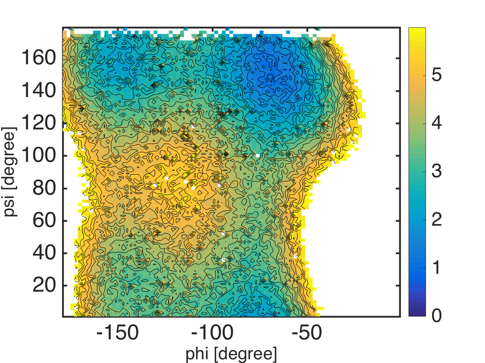
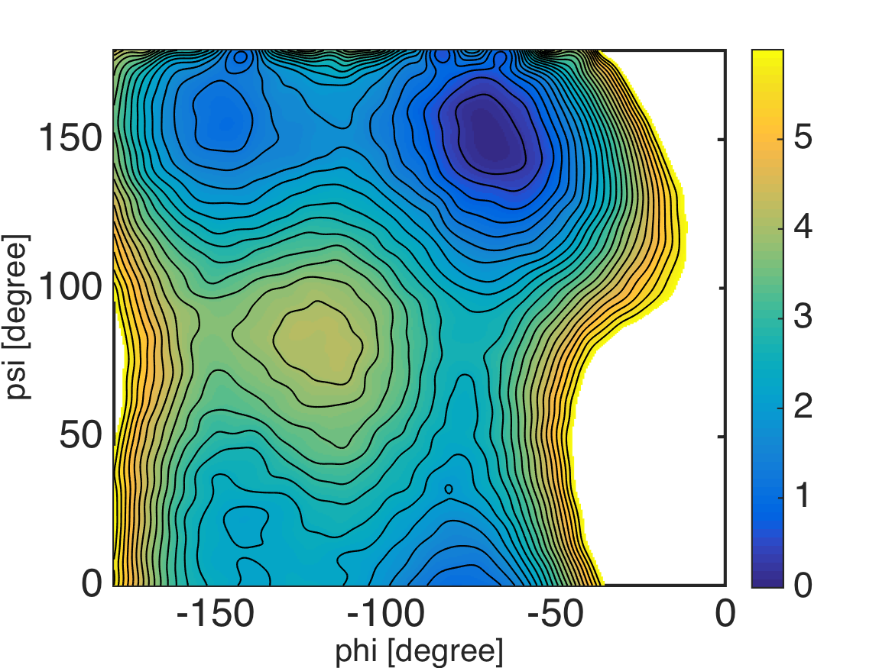

.. alad_2D_umbrella_mbar
.. highlight:: matlab

===========================================================================================
2D Umbrella Sampling of Alanine-Dipeptide and MBAR
===========================================================================================

This example is located in ``example/umbrella_alad/mbar/``.

::
  
  % this routine calculates free energies of umbrella systems 
  % by using MBAR
  
  %% constants
  C = getconstants();
  KBT = C.KB*300; % KB is the Boltzmann constant in kcal/(mol K)
  BETA = 1./KBT;
  
  %% define umbrella window centers
  center_phi = -180:15:-15;
  center_psi = 0:15:165;
  
  numbrella = numel(center_phi) * numel(center_psi);
  umbrella_center = zeros(numbrella, 2);
  count = 0;
  for i = 1:numel(center_phi)
    for j = 1:numel(center_psi)
      count = count + 1;
      umbrella_center(count, :) = [center_phi(i) center_psi(j)];
    end
  end
  
  %% define function handles of bias energy for umbrella windows
  for i = 1:numbrella
    K = 50 * (pi/180)^2; % conversion of the unit from kcal/mol/rad^2 to kcal/mol/deg^2
    fhandle_k{i} = @(x) BETA*sum(K*(periodic(x, umbrella_center(i, :))).^2, 2);
  end
  
  %% read dihedral angle data
  for i = 1:numbrella
    filename = sprintf('../4_prod/run_%d_%d.dat', umbrella_center(i, 1), umbrella_center(i, 2));
    x = load(filename);
    dihedral_k{i} = x(:, 2:3);
  end
  
  %% evaluate u_kl: reduced potential energy of umbrella simulation k evaluated at umbrella l
  % time-consuming part
  for k = 1:numbrella
    for l = 1:numbrella
      u_kl{k, l} = fhandle_k{l}(dihedral_k{k});
    end
  end
  
  %% MBAR: calculate free energies of umbrella systems
  f_k = mbar(u_kl);
  
  %% save results
  save -v7.3 calc_mbar.mat;

::
  
  function d = periodic(x, center)
  %
  %
  
  d = abs(bsxfun(@minus, x, center));
  
  index = d > 180;
  while any(index)
    d(index) = d(index) - 360;
    index = d > 180;
  end

::
  
  % this routine calculates 2-D potential of mean force (PMF)
  % from the result of MBAR
  
  %% read MBAR result
  load calc_mbar.mat numbrella dihedral_k u_kl f_k KBT;
  
  %% calculate PMF by counting weights of bins under restraint-free condition
  % assign bins
  nbin = 50;
  edge_phi = linspace(-180, 0, nbin+1);
  edge_psi = linspace(0, 180, nbin+1);
  for k = 1:numbrella
    [bin_k{k}, center_phi, center_psi] = assign2dbins(dihedral_k{k}, edge_phi, edge_psi);
  end
  
  % evaluate PMF of bins
  pmf = mbarpmf(u_kl, bin_k, f_k);
  
  % reshape PMF data
  pmf2 = zeros(nbin*nbin, 1);
  pmf2(:) = NaN;
  pmf2(1:numel(pmf)) = pmf;
  pmf2 = KBT*pmf2; % convert unit from KBT to kcal/mol
  pmf2 = pmf2 - min(pmf2(:));
  pmf = reshape(pmf2, nbin, nbin);
  
  %% visualization
  landscape(center_phi, center_psi, pmf, 0:0.25:6); colorbar;
  xlabel('phi [degree]', 'FontSize', 20, 'FontName', 'Helvetica');
  ylabel('psi [degree]', 'FontSize', 20, 'FontName', 'Helvetica');
  exportas('pmf_histogram');

::
  
  % this routine calculates 2-D potential of mean force (PMF)
  % from the result of MBAR
  
  %% read MBAR result
  load calc_mbar.mat numbrella dihedral_k u_kl f_k KBT;
  
  %% evaluate weights of data under restraint-free condition
  [~, w_k] = mbarpmf(u_kl, [], f_k);
  
  %% calculate PMF by using kernel density estimation
  % collect scattered data with weights
  data = [];
  for k = 1:numbrella
    data = [data; dihedral_k{k}];
  end
  
  weight = [];
  for k = 1:numbrella
    weight = [weight; w_k{k}];
  end
  
  % evaluate PMF by using a kernel density estimator
  center_phi = -180:0.5:0;
  center_psi = 0:0.5:180;
  pmf = calcpmf2d(data, center_phi, center_psi, [3.0 3.0], [360 360], weight);
  pmf = KBT*pmf; % convert unit from KBT to kcal/mol
  
  %% visualization
  landscape(center_phi, center_psi, pmf, 0:0.25:6); colorbar;
  xlabel('phi [degree]', 'FontSize', 20, 'FontName', 'Helvetica');
  ylabel('psi [degree]', 'FontSize', 20, 'FontName', 'Helvetica');
  exportas('pmf_ksdensity');

