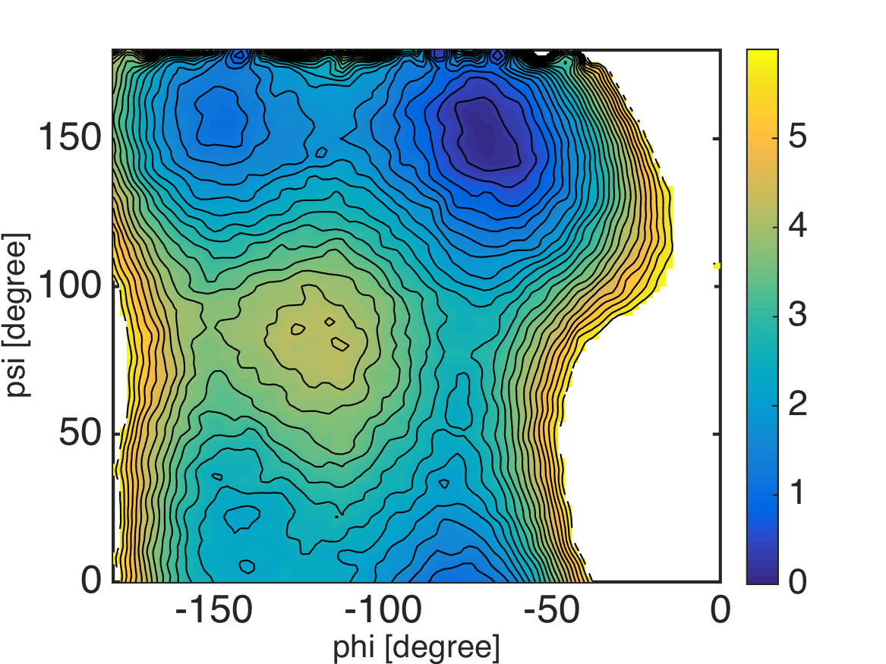

.. alad_2D_umbrella_mbar
.. highlight:: matlab

===========================================================================================
2D Umbrella Sampling of Alanine-Dipeptide and MBAR
===========================================================================================

Files for this example can be downloaded from `here <https://www.dropbox.com/s/5fu2t0ftlr8z3j6/mdtoolbox_example.tgz?dl=0>`_.
This example is located in ``mdtoolbox_example/umbrella_alad/mbar/``.

::
  
  % this routine calculates free energies of umbrella systems by using MBAR
  
  %% constants
  C = getconstants();
  KBT = C.KB*300; % KB is the Boltzmann constant in kcal/(mol K)
  
  %% define umbrella window centers
  center_phi = -180:15:-15;
  center_psi = 0:15:165;
  K = numel(center_phi)*numel(center_psi);
  
  umbrella_center = zeros(K, 2);
  k = 0;
  for i = 1:numel(center_phi)
    for j = 1:numel(center_psi)
      k = k + 1;
      umbrella_center(k, :) = [center_phi(i) center_psi(j)];
    end
  end
  
  %% read dihedral angle data
  for k = 1:K
    filename = sprintf('../4_prod/run_%d_%d.dat', umbrella_center(k, 1), umbrella_center(k, 2));
    x = load(filename);
    data_k{k} = x(:, 2:3);
  end
  
  %% evaluate u_kl: reduced bias-factor of umbrella simulation data k evaluated by umbrella l
  for k = 1:K
    for l = 1:K
      spring_constant = 50 * (pi/180)^2; % unit conversion from kcal/mol/rad^2 to kcal/mol/deg^2
      u_kl{k, l} = (spring_constant/KBT)*sum(minimum_image(umbrella_center(l, :), data_k{k}).^2, 2);
    end
  end
  
  %% MBAR: calculate free energies of umbrella systems
  f_k = mbar(u_kl);
  
  %% save results
  save calc_mbar.mat;

::
  
  function dx = minimum_image(center, x)
  dx = x - center;
  dx = dx - round(dx./360)*360;

::
  
  % this routine calculates 2-D potential of mean force (PMF) from the result of MBAR
  
  %% read MBAR result
  load calc_mbar.mat K data_k u_kl f_k KBT;
  
  %% calculate PMF by counting weights of bins under restraint-free condition
  % assign 1-dimensional bin index to 2-dimensional data
  M_phi = 90;
  M_psi = 90;
  edge_phi = linspace(-180, 0, M_phi+1);
  edge_psi = linspace(0, 180, M_psi+1);
  center_phi = 0.5 * (edge_phi(2:end) + edge_phi(1:(end-1)));
  center_psi = 0.5 * (edge_psi(2:end) + edge_psi(1:(end-1)));
  for k = 1:K
    bin_phi = assign1dbin(data_k{k}(:, 1), edge_phi);
    bin_psi = assign1dbin(data_k{k}(:, 2), edge_psi);
    bin_k{k} = M_psi*(bin_phi-1) + bin_psi;
  end
  
  % evaluate PMF of bins
  pmf = mbarpmf(u_kl, bin_k, f_k);
  
  % reshape PMF data
  pmf2 = zeros(M_phi*M_psi, 1);
  pmf2(:) = NaN;
  pmf2(1:numel(pmf)) = pmf;
  pmf2 = KBT*pmf2; % convert unit from KBT to kcal/mol
  pmf2 = pmf2 - min(pmf2(:));
  pmf = reshape(pmf2, M_psi, M_phi);
  
  %% visualization
  landscape(center_phi, center_psi, pmf, 0:0.25:6); colorbar;
  xlabel('phi [degree]', 'FontSize', 20, 'FontName', 'Helvetica');
  ylabel('psi [degree]', 'FontSize', 20, 'FontName', 'Helvetica');
  exportas('pmf_histogram');

.. image:: ./images/pmf_histogram.png
   :width: 90 %
   :alt: scatter
   :align: center

::
  
  % this routine calculates 2-D potential of mean force (PMF) from the result of MBAR
  
  %% read MBAR result
  load calc_mbar.mat K data_k u_kl f_k KBT;
  
  %% evaluate weights of data under restraint-free condition
  [~, w_k] = mbarpmf(u_kl, [], f_k);
  
  %% calculate PMF by using kernel density estimation
  % collect scattered data with weights
  data = [];
  for k = 1:K
    data = [data; data_k{k}];
  end
  
  weight = [];
  for k = 1:K
    weight = [weight; w_k{k}];
  end
  
  % evaluate PMF by using a kernel density estimator
  center_phi = -180:2.0:0;
  center_psi = 0:2.0:180;
  pmf = calcpmf2d(data, center_phi, center_psi, [2.0 2.0], [360 360], weight);
  pmf = pmf*KBT; % convert unit from KBT to kcal/mol
  
  %% visualization
  landscape(center_phi, center_psi, pmf, 0:0.25:6); colorbar;
  xlabel('phi [degree]', 'FontSize', 20, 'FontName', 'Helvetica');
  ylabel('psi [degree]', 'FontSize', 20, 'FontName', 'Helvetica');
  exportas('pmf_ksdensity');

