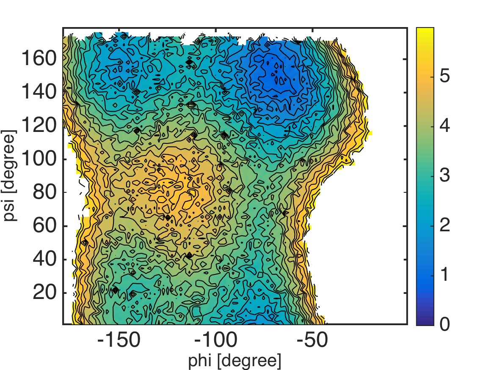

.. alad_2D_umbrella_wham
.. highlight:: matlab

===========================================================================================
2D Umbrella Sampling of Alanine-Dipeptide and WHAM
===========================================================================================

Files for this example can be downloaded from `here <https://briefcase.riken.jp/public/bzXsQA0f2g7AXVIBSRRPbX0AkkO1ymuB7UkKJvj1QO52>`_.
This example is located in ``mdtoolbox_example/umbrella_alad/wham/``.

::
  
  % this routine calculates free energies of umbrella systems by using WHAM
  
  %% setup constants
  C = getconstants();
  KBT = C.KB*300; % KB is the Boltzmann constant in kcal/(mol K)
  
  %% umbrella window centers
  center_phi = -180:15:-15;
  center_psi = 0:15:165;
  K = numel(center_phi)*numel(center_psi);
  
  umbrella_center = zeros(K, 2);
  k = 0;
  for j = 1:numel(center_psi)
    for i = 1:numel(center_phi)
      k = k + 1;
      umbrella_center(k, :) = [center_phi(i) center_psi(j)];
    end
  end
  
  %% define edges for histogram bin
  edge_phi = linspace(-180, 0, 81);
  edge_psi = linspace(0, 180, 71);
  bin_center_phi = 0.5 * (edge_phi(2:end) + edge_phi(1:(end-1)));
  bin_center_psi = 0.5 * (edge_psi(2:end) + edge_psi(1:(end-1)));
  M = numel(bin_center_phi)*numel(bin_center_psi);
  
  bin_center = zeros(M, 2);
  m = 0;
  for j = 1:numel(bin_center_psi)
    for i = 1:numel(bin_center_phi)
      m = m + 1;
      bin_center(m, :) = [bin_center_phi(i) bin_center_psi(j)];
    end
  end
  
  %% read dihedral angle data
  data_k = {};
  for k = 1:K
    filename = sprintf('../4_prod/run_%d_%d.dat', umbrella_center(k, 1), umbrella_center(k, 2));
    x = load(filename);
    data_k{k} = x(:, 2:3);
  end
  
  %% calculate histogram (h_km)
  % h_km: histogram (data counts) of k-th umbrella data counts in m-th data bin
  h_km = zeros(K, M);
  for k = 1:K
    [~, histogram] = assign2dbin(data_k{k}, edge_phi, edge_psi);
    h_km(k, :) = histogram(:)';
  end
  
  %% bias-factor
  % bias_km: bias-factor of k-th umbrella-window evaluated at m-th bin-center
  bias_km = zeros(K, M);
  for k = 1:K
    for m = 1:M
      spring_constant = 50 * (pi/180)^2; % conversion of the unit from kcal/mol/rad^2 to kcal/mol/deg^2
      bias_km(k, m) = (spring_constant./KBT)* sum(minimum_image(umbrella_center(k, :), bin_center(m, :)).^2, 2);
    end
  end
  
  %% WHAM
  % evaluate the potential of mean force (PMF) in dihedral angle space
  [f_k, pmf] = wham(h_km, bias_km);
  pmf = KBT*pmf;
  pmf = pmf - min(pmf(:));
  
  %% visualization
  pmf2d = zeros(numel(bin_center_phi), numel(bin_center_psi));
  pmf2d(:) = pmf(:);
  landscape(bin_center_phi, bin_center_psi, pmf2d', 0:0.25:6); colorbar;
  xlabel('phi [degree]', 'FontSize', 20, 'FontName', 'Helvetica');
  ylabel('psi [degree]', 'FontSize', 20, 'FontName', 'Helvetica');
  exportas('analyze');
  
  %% save results
  save analyze.mat;

::

  function dx = minimum_image(center, x)
  dx = x - center;
  dx = dx - round(dx./360)*360;

