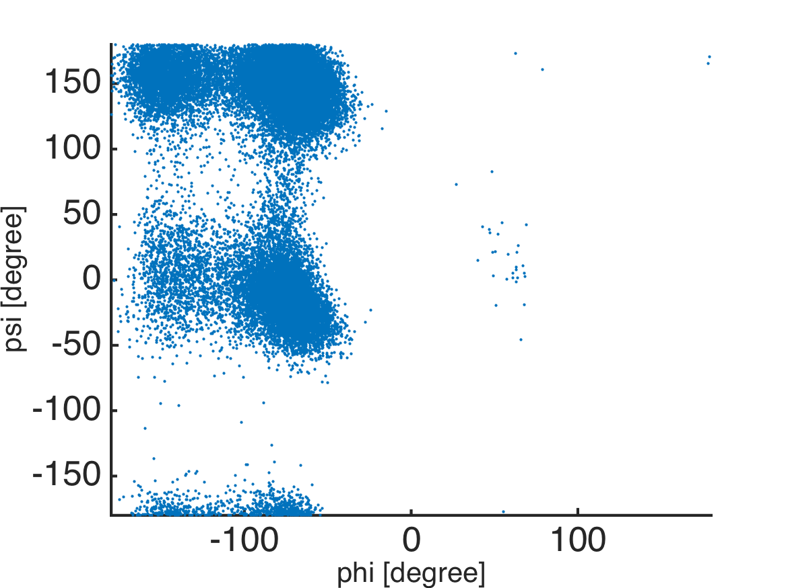
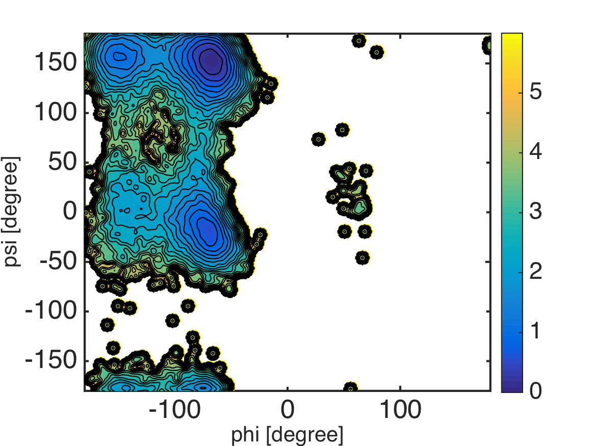

.. alad_ksdensity
.. highlight:: matlab

===========================================================================================
Conventional MD of Alanine-Dipeptide and 2D PMF surface
===========================================================================================

Files for this example can be downloaded from `here <https://www.dropbox.com/s/jwep4yxwsdv8w87/mdtoolbox_example.tgz?dl=0>`_.
This example is located in ``mdtoolbox_example/md_alad/pmf/``.

We calculate the surface of potential of mean force (PMF) in a
2-dimensional dihedral angle space. Molecular dynamics trajectory of
alanine-dipeptide solvated in explicit water models is used for the
demonstration.  

First, we extract dihedral angles from the trajectory: 
::
  
  %% read data
  trj = readnetcdf('../3_prod/run.nc');
  
  %% define atom indices for dihedral angles
  index_phi = [5 7 9 15];
  index_psi = [7 9 15 17];
  
  %% calculate dihedral angles
  phi = calcdihedral(trj, index_phi);
  psi = calcdihedral(trj, index_psi);
  
  %% convert the unit from radian to degree
  phi = phi.*180./pi;
  psi = psi.*180./pi;

Next, the probability density function (PDF) in the
2-dimentional dihedral space is estimated from the scattered data
(``phi`` and ``psi``). This can be done by using the bivariate kernel
density estimation (``ksdensity2d.m``) which is called in
``calcpmf2d.m`` routine. 
::

  %% scattered plot of the dihedral angles
  scatter(phi, psi, 5, 'filled');
  axis([-180 180 -180 180]); axis xy;
  formatplot2
  xlabel('phi [degree]', 'FontSize', 20, 'FontName', 'Helvetica');
  ylabel('psi [degree]', 'FontSize', 20, 'FontName', 'Helvetica');
  exportas('scatter');
  
  %% calculate PMF and visualize the surface
  xi = -180:2:180; % grids in x-axis
  yi = -180:2:180; % grids in y-axis
  pmf = calcpmf2d([phi psi], xi, yi, [3.0 3.0], [360 360]);
  s   = getconstants(); % get Boltzmann constant in kcal/mol/K
  T   = 300.0;          % set temperature
  pmf = s.KB*T*pmf;     % convert unit from KBT to kcal/mol
  
  %% visualization
  landscape(xi, yi, pmf, 0:0.25:6); colorbar;
  axis([-180 180 -180 180]);
  xlabel('phi [degree]', 'FontSize', 20, 'FontName', 'Helvetica');
  ylabel('psi [degree]', 'FontSize', 20, 'FontName', 'Helvetica');
  exportas('pmf');

Note that the kernel density estimator tends to broaden
the "true" PDF surface by a convolution with a Gaussian kernel. 
So, we should be careful especially when interested in small dips or
barrier heights on the surface.

