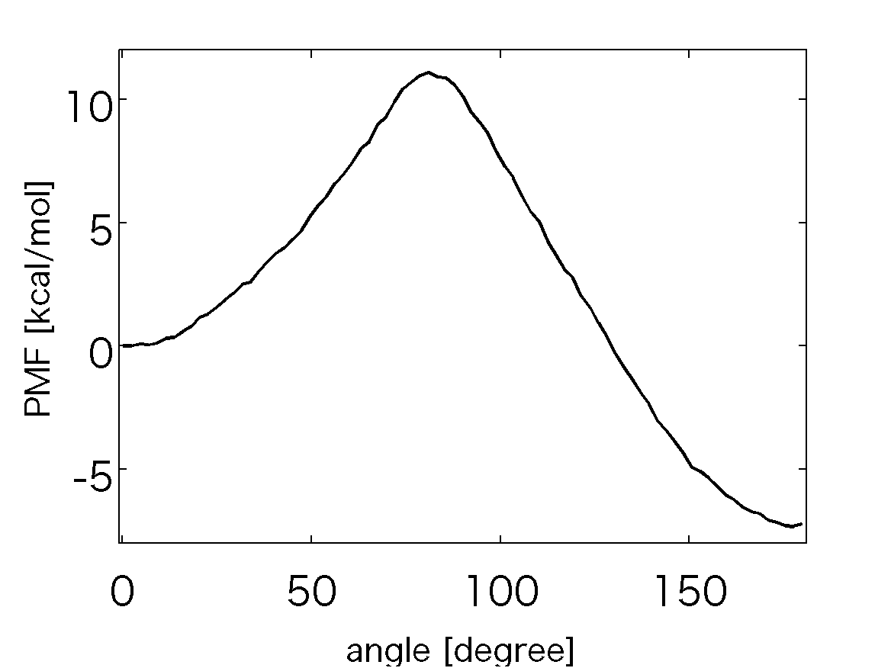

.. alat_1D_umbrella_wham
.. highlight:: matlab

======================================================================================
1D Umbrella Sampling of Tri-Alanine and WHAM
======================================================================================

Files for this example can be downloaded from `here <https://www.dropbox.com/s/jwep4yxwsdv8w87/mdtoolbox_example.tgz?dl=0>`_.
This example is located in ``mdtoolbox_example/umbrella_alat/wham/``.

::
  
  % this routine calculates the Potential of Mean Force (PMF) from
  % umbrella sampling data by using WHAM
  
  %% setup constants
  C = getconstants();
  KBT = C.KB*300; % KB is the Boltzmann constant in kcal/(mol K)
  
  %% define umbrella window centers
  umbrella_center = 0:3:180;
  numbrella = numel(umbrella_center);
  
  %% read dihedral angle data
  dihedral_k = {};
  for i = 1:numbrella
    filename = sprintf('../3_prod/run_%d.dat', umbrella_center(i));
    x = load(filename);
    dihedral_k{i} = x(:, 2);
  end
  
  %% define a function handle of bias energy for each umbrella window
  fhandle_k = {};
  for i = 1:numbrella
    k = 200 * (pi/180)^2; % conversion of the unit from kcal/mol/rad^2 to kcal/mol/deg^2
    fhandle_k{i} = @(x) k*(periodic(x, umbrella_center(i))).^2;
  end
  
  %% WHAM
  % calculate probabilities in the dihedral angle space, 
  % and then evaluate the potential of mean force (PMF)
  [f_k, log_prob_m, center] = wham(dihedral_k, fhandle_k, 300, linspace(-1, 181, 82));
  pmf = - KBT * log_prob_m;
  pmf = pmf - pmf(1);
  
  %% plot the PMF
  hold off
  plot(center, pmf, 'k-');
  formatplot
  xlabel('angle [degree]', 'fontsize', 20);
  ylabel('PMF [kcal/mol]', 'fontsize', 20);
  axis([-1 181 -8 12]);
  exportas('analyze')
  hold off
  
  %% save results
  save -v7.3 analyze.mat;

::
  
  function dx = periodic(x, center)
  %
  %
  
  dx = x - center;
  dx = dx - round(dx./360)*360;
  

