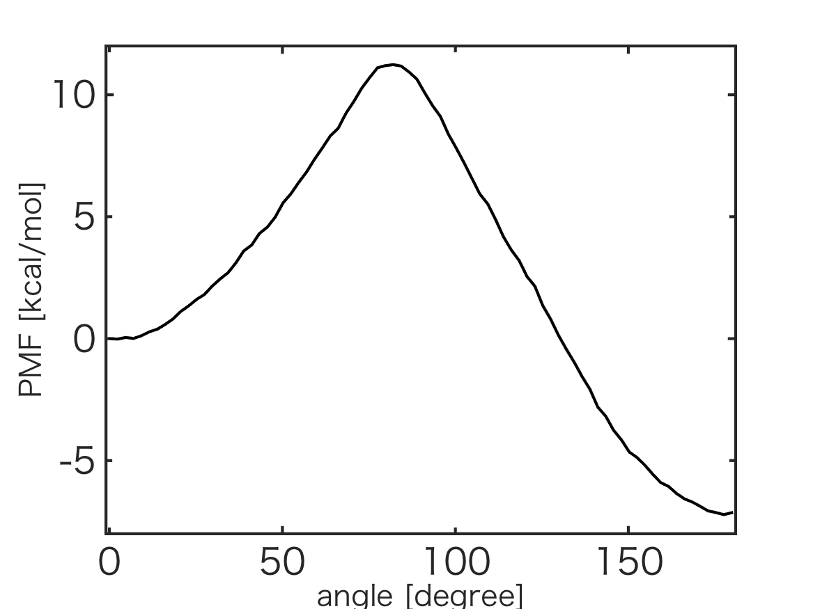

.. alat_1D_umbrella_wham
.. highlight:: matlab

======================================================================================
1D Umbrella Sampling of Tri-Alanine and WHAM
======================================================================================

Files for this example can be downloaded from `here <https://www.dropbox.com/s/5fu2t0ftlr8z3j6/mdtoolbox_example.tgz?dl=0>`_.
This example is located in ``mdtoolbox_example/umbrella_alat/wham/``.

::
  
  % this routine calculates the Potential of Mean Force (PMF) from
  % umbrella sampling data by using WHAM
  
  %% setup constants
  C = getconstants();
  KBT = C.KB*300; % KB is the Boltzmann constant in kcal/(mol K)
  
  %% umbrella window centers
  umbrella_center = 0:3:180;
  K = numel(umbrella_center);
  
  %% define edges for histogram bin
  M = 80; % number of bins
  edge = linspace(-1, 181, M+1);
  bin_center = 0.5 * (edge(2:end) + edge(1:(end-1)));
  
  %% read dihedral angle data
  data_k = {};
  for k = 1:K
    filename = sprintf('../3_prod/run_%d.dat', umbrella_center(k));
    x = load(filename);
    data_k{k} = x(:, 2);
  end
  
  %% calculate histogram (h_km)
  % h_km: histogram (data counts) of k-th umbrella data counts in m-th data bin
  h_km = zeros(K, M);
  for k = 1:K
    [~, h_m] = assign1dbin(data_k{k}, edge);
    h_km(k, :) = h_m;
  end
  
  %% bias-factor
  % bias_km: bias-factor of k-th umbrella-window evaluated at m-th bin-center
  bias_km = zeros(K, M);
  for k = 1:K
    for m = 1:M
      spring_constant = 200 * (pi/180)^2; % conversion of the unit from kcal/mol/rad^2 to kcal/mol/deg^2
      bias_km(k, m) = (spring_constant./KBT)*(minimum_image(umbrella_center(k), bin_center(m))).^2;
    end
  end
  
  %% WHAM
  % calculate probabilities in the dihedral angle space, and evaluate the potential of mean force (PMF)
  [f_k, pmf] = wham(h_km, bias_km);
  pmf = KBT*pmf;
  pmf = pmf - pmf(1);
  
  %% plot the PMF
  hold off
  plot(bin_center, pmf, 'k-');
  formatplot
  xlabel('angle [degree]', 'fontsize', 20);
  ylabel('PMF [kcal/mol]', 'fontsize', 20);
  axis([-1 181 -8 12]);
  exportas('analyze')
  hold off
  
  %% save results
  save analyze.mat;

::
  
  function dx = minimum_image(center, x)
  dx = x - center;
  dx = dx - round(dx./360)*360;

