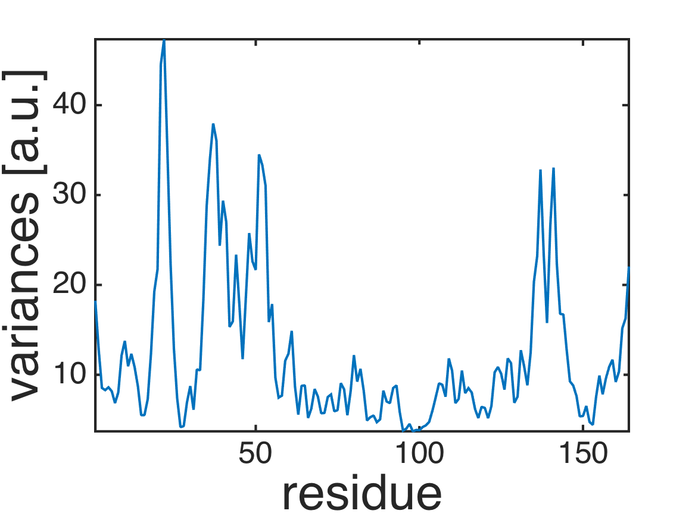
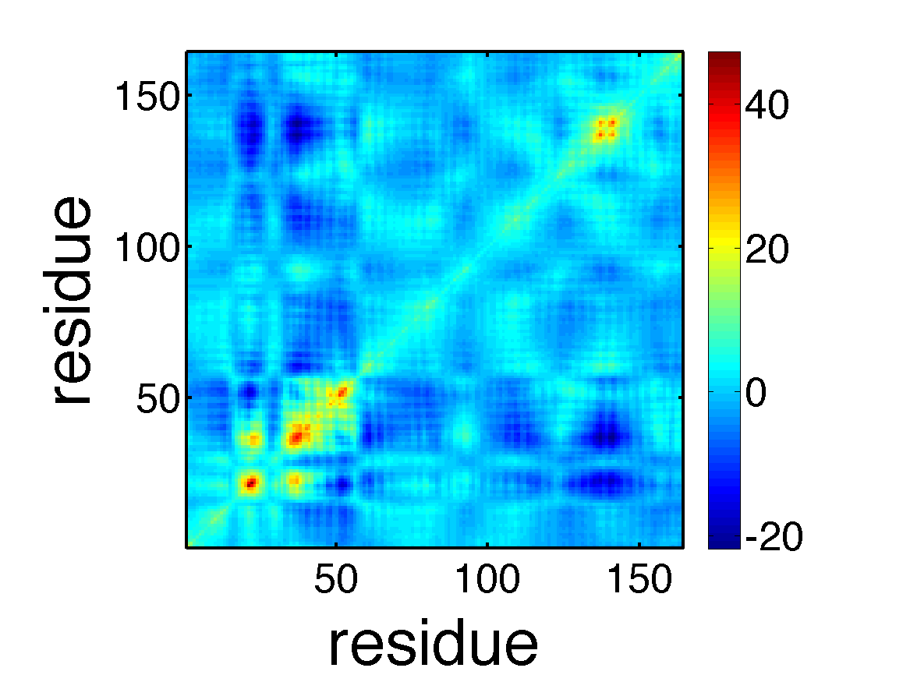
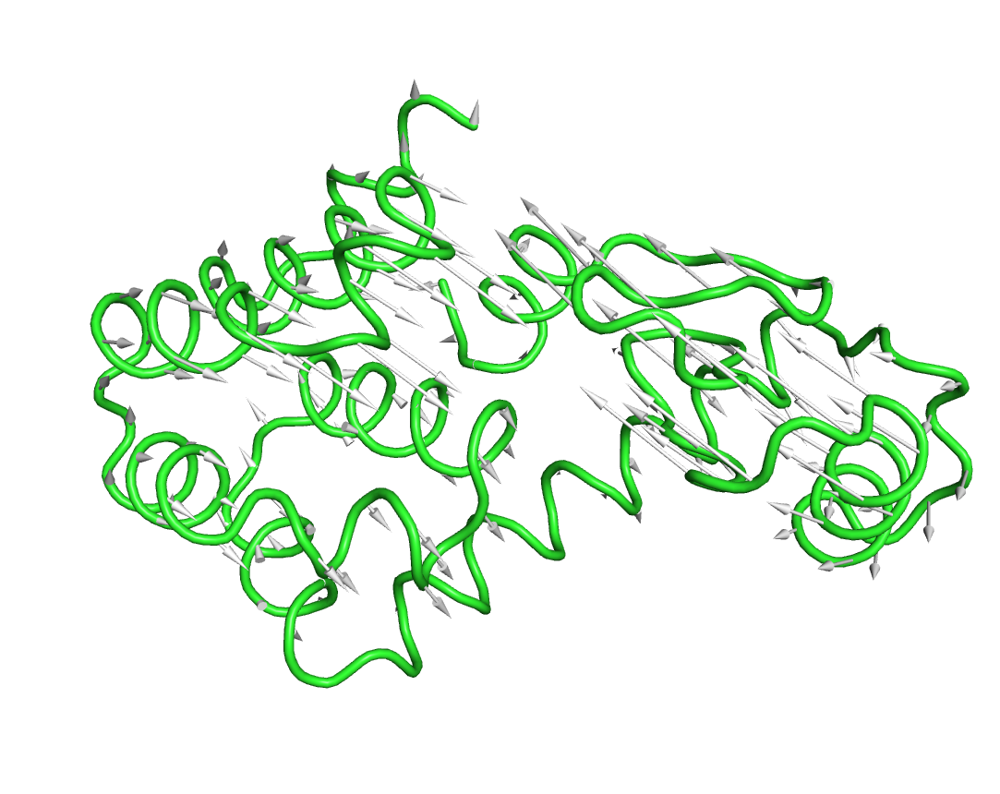
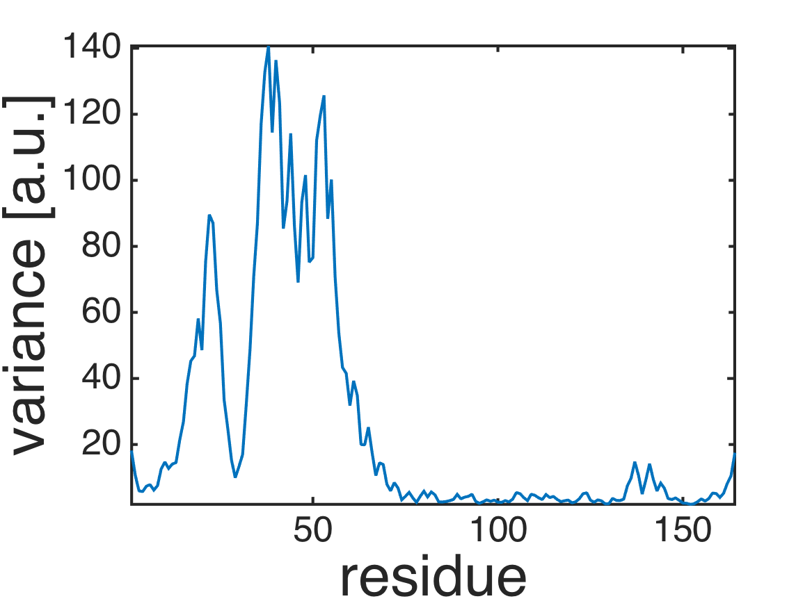
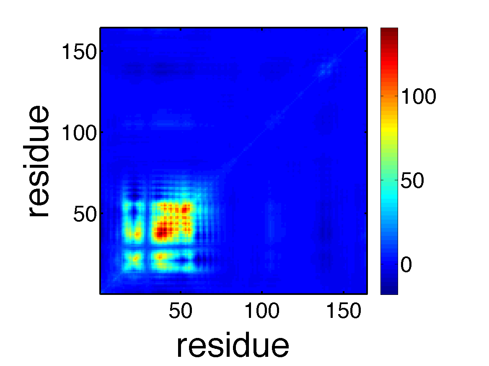
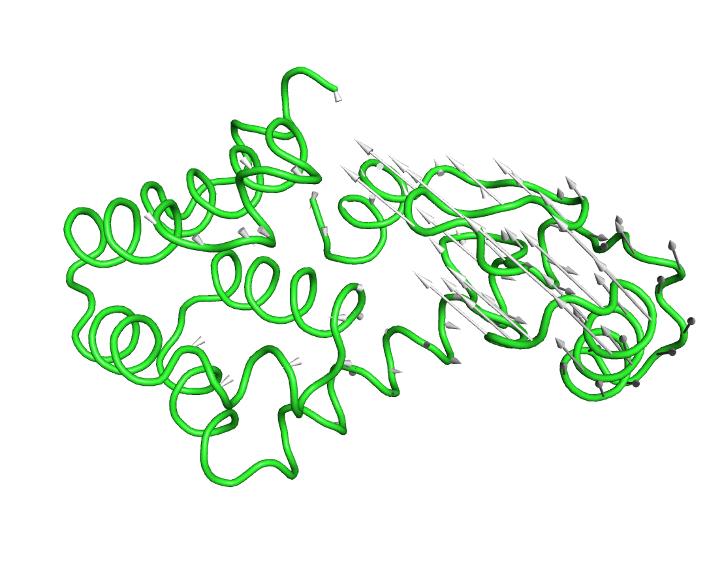

.. anm
.. highlight:: matlab

==============================================================
Anisotropic Network Model
==============================================================

This example is located in ``example/anm/``.

Normal mode analysis of ANM
^^^^^^^^^^^^^^^^^^^^^^^^^^^
Normal mode analysis of Ca-based anisotropic network model of T4 lysozyme (``script_anm.m``). 
::
  
  %% Nomal mode analysis of Ca-based anisotropic network model of T4 lysozyme
  
  % read Ca coordinates from PDB file
  [pdb, crd] = readpdb('lys.pdb');
  index_ca = selectname(pdb.name, 'CA');
  pdb = substruct(pdb, index_ca);
  crd = crd(to3(index_ca));
  crd = decenter(crd);
  
  % normal mode of anisotropic network model (ANM)
  [emode, frequency, covar, covar_atom] = anm(crd, 8.0);
  
  % plot root-mean-square-fluctuations (RMSF) and covariances
  plot(diag(covar_atom));
  axis tight;
  xlabel('residue','fontsize',40);
  ylabel('variances [a.u.]','fontsize',40);
  formatplot
  exportas('rmsf');
  
  imagesc(covar_atom);
  axis xy;
  axis square;
  xlabel('residue','fontsize',40);
  ylabel('residue','fontsize',40);
  colorbar;
  formatplot2
  exportas('covar_atom');
  
  % export PDB files for visalizing mode structures
  pdb.xyz = reshape(crd, 3, [])';
  writepdb('lys_ca.pdb', pdb);
  crd1 = crd + emode(:, 1)'*50;
  pdb.xyz = reshape(crd1, 3, [])';
  writepdb('lys_mode1.pdb', pdb);
  
  % save data
  save script_anm.mat;

Visualize mode structures (``viz_mode1.pml``).
::

  $ cat viz_mode1.pml
  ## Visualize mode structures with PyMOL
  ## usage: pymol -d "@viz_mode1.pml"
  
  load lys_ca.pdb
  load lys_mode1.pdb
  
  set cartoon_trace_atoms, 1
  set cartoon_tube_radius, 0.3
  cartoon tube
  as cartoon
  
  run modevectors.py
  modevectors lys_ca, lys_mode1, head=0.3, tail=0.1, head_length=1.3, cutoff=0.5
  
  ray
  png viz_mode1.png
  
  $ pymol -d "@viz_mode1.pml"

Transformation of frame
^^^^^^^^^^^^^^^^^^^^^^^

Transform from the Eckart frame to a non-Eckart frame (``script_transformframe.m``).
::
  
  %% Transform from the Eckart frame to a non-Eckart frame.
  
  % load data
  save script_anm.mat;
  
  % transform frame
  index_fixeddomain = [1:11 77:164]; %atom-index for the larger domain
  external_mode = emode(:,(end-5):end);
  [emode2, variances2, covar2, covar2_atom] = transformframe(index_fixeddomain, external_mode, covar);
  
  % plot root-mean-square-fluctuations (RMSF) and covariances
  plot(diag(covar2_atom));
  axis tight;
  xlabel('residue','FontSize',40);
  ylabel('variance [a.u.]','FontSize',40);
  formatplot
  exportas('rmsf_ne');
  
  imagesc(covar2_atom);
  axis xy;
  axis square;
  xlabel('residue','FontSize',40);
  ylabel('residue','FontSize',40);
  colorbar;
  formatplot2;
  exportas('covar_atom_ne');
  
  % export PDB files for visalizing mode structures
  crd2 = crd + emode2(:, 1)'*50;
  pdb.xyz = reshape(crd2, 3, [])';
  writepdb('lys_mode1_ne.pdb', pdb);
  
  % save data
  save script_transformframe.mat;

Visualize mode structures (``viz_mode_ne.pml``).
::

  $ cat viz_mode1_ne.pml  
  ## Visualize mode structures with PyMOL
  ## usage: pymol -d "@viz_mode1_ne.pml"
  
  load lys_ca.pdb
  load lys_mode1_ne.pdb
  
  set cartoon_trace_atoms, 1
  set cartoon_tube_radius, 0.3
  cartoon tube
  as cartoon
  
  run modevectors.py
  modevectors lys_ca, lys_mode1_ne, head=0.3, tail=0.1, head_length=1.3, cutoff=0.5
  
  ray
  png viz_mode1_ne.png
  
  $ pymol -d "viz_mode1_ne.pml"

