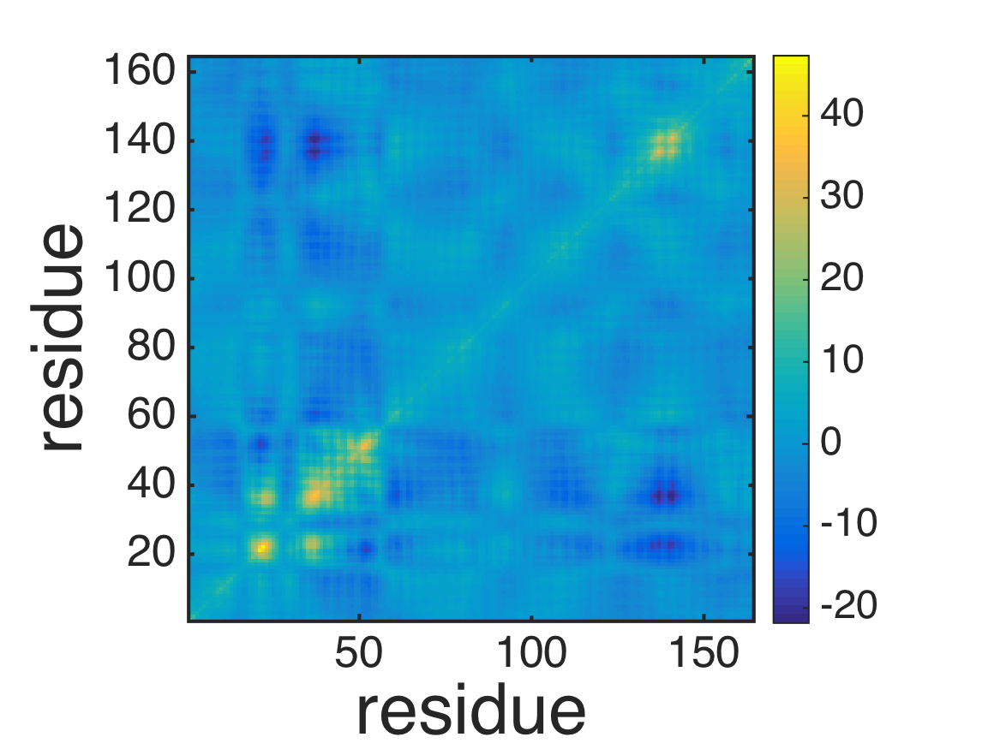
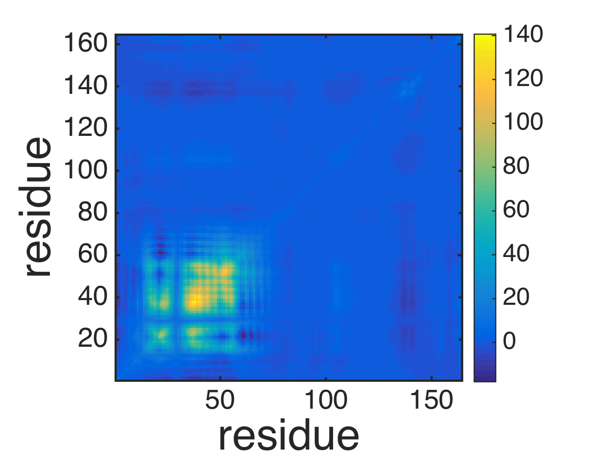
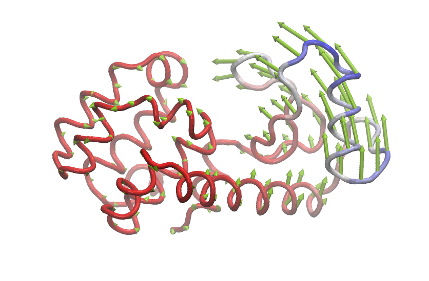

.. anm
.. highlight:: matlab

==============================================================
Anisotropic Network Model
==============================================================

This example is located in ``example/anm_lys/``.

Normal mode analysis of ANM
---------------------------
Normal mode analysis of Ca-based anisotropic network model of T4 lysozyme (``script_anm.m``). 
::
  
  %% Nomal mode analysis of anisotropic network model of T4 lysozyme
  
  % read Ca coordinates from PDB file
  [pdb, crd] = readpdb('lys.pdb');
  index_ca = selectname(pdb.name, 'CA');
  crd = crd(to3(index_ca));
  crd = decenter(crd);
  
  % normal mode of anisotropic network model (ANM)
  [emode, frequency, covar, covar_atom] = anm(crd, 8.0);
  
  % plot root-mean-square-fluctuations (RMSF)
  plot(diag(covar_atom)); 
  axis tight;
  xlabel('residue','fontsize',40); 
  ylabel('variances [a.u.]','fontsize',40); 
  formatplot
  exportas('rmsf');
  
  % plot covariance
  imagesc(covar_atom); 
  axis xy; axis square;
  xlabel('residue','fontsize',40); 
  ylabel('residue','fontsize',40); 
  colorbar; 
  formatplot2
  exportas('covar_atom');
  
  % export NMD file for visalizing mode structures
  writenmd('anm.nmd', crd, emode);
  
  % save data
  save script_anm.mat;

.. image:: ./images/rmsf.png
   :width: 50 %
   :alt: rmsf
   :align: center

Visualize mode structures by using the Normal mode wizard in VMD.
::
  
  $ vmd
  vmd > nmwiz load anm.nmd

Transformation of frame
-----------------------

Transform from the Eckart frame to a non-Eckart frame (``script_transformframe.m``).
::
  
  %% Transform from the Eckart frame to a non-Eckart frame.
  
  % load data
  load script_anm.mat;
  
  % transform frame
  index_fixeddomain = [1:11 77:164]; %atom-index for the larger domain 
  external_mode = emode(:,(end-5):end);
  [emode2, variances2, covar2, covar2_atom] = transformframe(index_fixeddomain, external_mode, covar);
  
  % plot root-mean-square-fluctuations (RMSF)
  plot(diag(covar2_atom)); 
  axis tight;
  xlabel('residue','FontSize',40); 
  ylabel('variance [a.u.]','FontSize',40); 
  formatplot
  exportas('rmsf_ne');
  
  % plot covariance
  imagesc(covar2_atom); 
  axis xy; axis square;
  xlabel('residue','FontSize',40); 
  ylabel('residue','FontSize',40); 
  colorbar; 
  formatplot2;
  exportas('covar_atom_ne');
  
  % export PDB files for visalizing mode structures
  writenmd('anm_ne.nmd', crd, emode2);
  
  % save data
  save script_transformframe.mat;

Visualize mode structures by using the Normal mode wizard in VMD.
::
  
  $ vmd
  vmd > nmwiz load anm_ne.nmd

