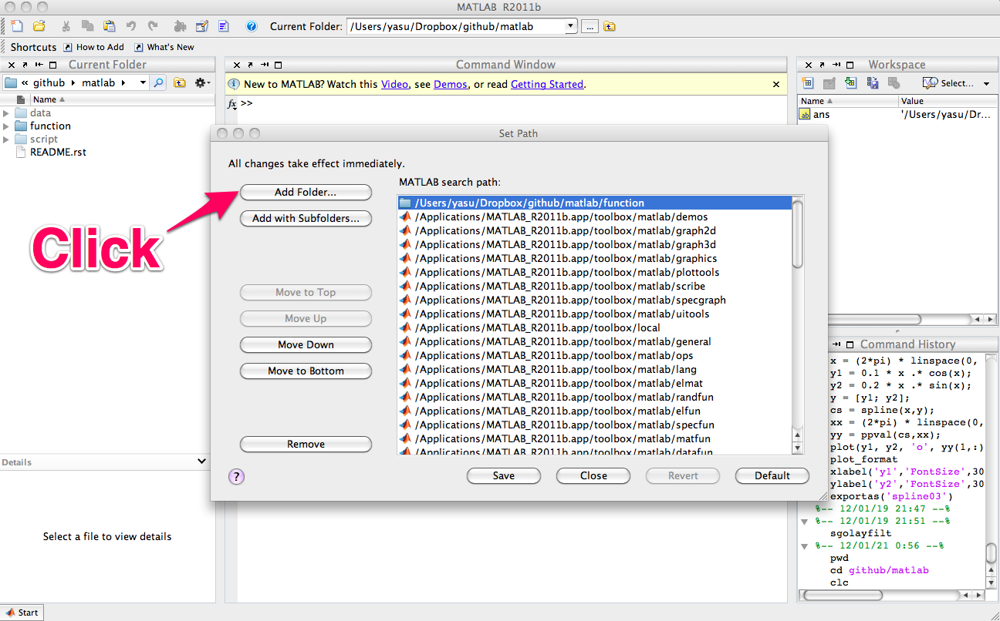

.. introduction
.. highlight:: matlab

Introduction
==================================

What is MDToolbox?
----------------------------------

MDToolbox is a MATLAB toolbox for statistical analysis of molecular
dynamics (MD) simulation data of biomolecules. It consists of a
collection of MATLAB functions covering the following types of
scientific computations: 

* I/O for trajectory, coordinate, and topology files used for MD simulation
* Least-squares fitting of structures
* Potential mean force (PMF) or free energy profile from scattered data
* Statistical estimates (WHAM and MBAR methods) from biased data
* Dimensional reductions (Principal Component Analysis, and others)
* Elastic network models (Gaussian and Anisotropic network models)
* Utility functions, such as atom selections

MDToolbox is developed on `GitHub <https://github.com/ymatsunaga/mdtoolbox/>`_,
and freely available under the BSD license. 

Download and Installation
----------------------------------

`Zip arichive <https://github.com/ymatsunaga/mdtoolbox/zipball/master>`_ or `tarball
<https://github.com/ymatsunaga/mdtoolbox/tarball/master>`_ 
of the latest version is available from `GitHub <https://github.com/ymatsunaga/mdtoolbox/>`_,
or the repository can be directly cloned from GitHub by using git, 
::

 $ git clone https://github.com/ymatsunaga/mdtoolbox.git

For personal installation, the personal startup file may be found at 
``~/matlab/startup.m``.  If it does not exist, create one.  
Add the following line to ``startup.m`` with full path to the
directory of MDToolbox m-files, 
::
 
 addpath('/path/to/mdtoolbox/mdtoolbox/')

For system-wide installation, call ``pathtool`` command in MATLAB
and add the directory to the user's MATLAB search
path (root permission is required to save the path),

In addition to the original m-files, MEX-files are prepared for core
functions to accelerate the performance (here, MEX-file means
a C-function called from the MATLAB command line). **We strongly
recommend to use these MEX-files for reasonable performance**. 
To use MEX-files, the user needs to compile the files in advance.
For the compilation, a prepared ``make.m`` script can be used as follows:
::
  
  >> cd /path/to/mdtoolbox/
  >> make

Warnings during the compilation can be safely ignored.

On Linux platforms, OpenMP option can be enabled further performance
by parallel computation, 
::
  
  >> make('openmp')

For parallel run, make sure to set your environment
variable (``OMP_NUM_THREADS``) before starting up MATLAB. For example,
if you want to use 8 threads(=CPU cores) parallelization, the variable
should be set from the shell prompt as follows:
::
  
  # for sh/bash/zsh
  $ export OMP_NUM_THREADS=8
  # for csh/tcsh
  $ setenv OMP_NUM_THREADS 8

List of functions
----------------------------------

Representative functions of MDToolbox are summarized in the tables
below. 

Inuput/Output

========================== ==================================================================================================
name                       description
========================== ==================================================================================================
readpdb                    read Protein Data Bank (PDB) file
writepdb                   write Protein Data Bank (PDB) file
readprmtop                 read amber parameter/topology file
readambercrd               read amber coordinate/restart file
readamberout               read amber output file
readmdcrd                  read amber ascii-format trajectory file
readmdcrdbox               read amber ascii-format trajectory file including box size
readnetcdf                 read amber netcdf file
writeambercrd              write amber coordinate/restart file
writemdcrd                 write amber ascii-format trajectory format file
writenetcdf                write amber netcdf file
readpsf                    read charmm or xplor type Protein Structure File (PSF)
readdcd                    read xplor or charmm (namd) format dcd file
readnamdbin                read namd restart (namdbin) file
readnamdout                read namd output file
writedcd                   write xplor or charmm (namd) format dcd file
writenamdbin               write namd restart (namdbin) file
readgro                    read gromacs gro (Gromos87 format) file
writegro                   write gromacs gro (Gromos87 format) file
readdx                     read dx (opendx) format file
writedx                    write dx (opendx) format file
========================== ==================================================================================================

Geometry calculations (Distance, angles, dihedrals, fitting of structures, etc)

========================== ==================================================================================================
name                       description
========================== ==================================================================================================
superimpose                least-squares fitting of structures by Kabsch's method
meanstructure              calculate average structure by iterative superimposing
decenter                   remove the center of mass from coordinates or velocities
orient                     orient molecule using the principal axes of inertia
searchrange                finds all the atoms within cutoff distance from given atoms
calcbond                   calculate distance from the Cartesian coordinates of two atoms
calcangle                  calculate angle from the Cartesian coordinates of three atoms
calcdihedral               calculate dihedral angle from the Cartesian coordinates of four atoms
calcpairlist               make a pairlist by searching pairs within a cutoff distance
========================== ==================================================================================================

Statistics (WHAM, MBAR, clustering, etc)

========================== ==================================================================================================
name                       description
========================== ==================================================================================================
wham                       Weighted Histogram Analysis method (WHAM)
ptwham                     Parallel tempering WHAM (PTWHAM)
mbar                       multi-state Bennett Acceptrance Ratio Method (MBAR)
calcpmf                    calculate 1D potential of mean force from the scattered 1D-data (using kernel density estimator)
calcpmf2d                  calculate 2D potential of mean force from the scattered 2D-data (using kernel density estimator)
calcpca                    peform principal component analysis (PCA)
calctica                   perform time-structure based Independent Component Analysis (tICA)
clusteringbykcenter        clustering by K-center
clusteringbykmeans         clustering by K-means
calctransitionmatrix       calculate transition probability matrix
========================== ==================================================================================================

Anisotropic Network Model

========================== ==================================================================================================
name                       description
========================== ==================================================================================================
anm                        calculate normal modes and anisotropic fluctuations by using Anisotropic Network Model.
anmsparse                  calculate normal modes of ANM using sparse-matrix for reducing memory size
anmsym                     calculate normal modes of ANM for molecule with circular symmetry using symmetric coordinates
transformframe             transform the normal modes from the Eckart frame to a non-Eckart frame
========================== ==================================================================================================

Utility functions (atom selections, index operations, etc)

========================== ======================================================================================================
name                       description
========================== ======================================================================================================
selectname                 used for atom selection. Returns logical-index for the atoms which matches given names
selectid                   used for atom selection. Returns logical-index for the atoms which matches given index
selectrange                used for atom selection. Returns logical-index for the atoms within cutoff distance from given atoms
to3                        convert 1...N atom index (or logical-index) to 1...3N xyz index (or logical-index)
formatplot                 fomart the handle properties (fonts, lines, etc.) of the current figure
exportas                   export fig, eps, png, tiff files of the current figure
addstruct                  create a structure by making the union of arrays of two structure variables
substruct                  create a subset structure from a structure of arrays
========================== ======================================================================================================

