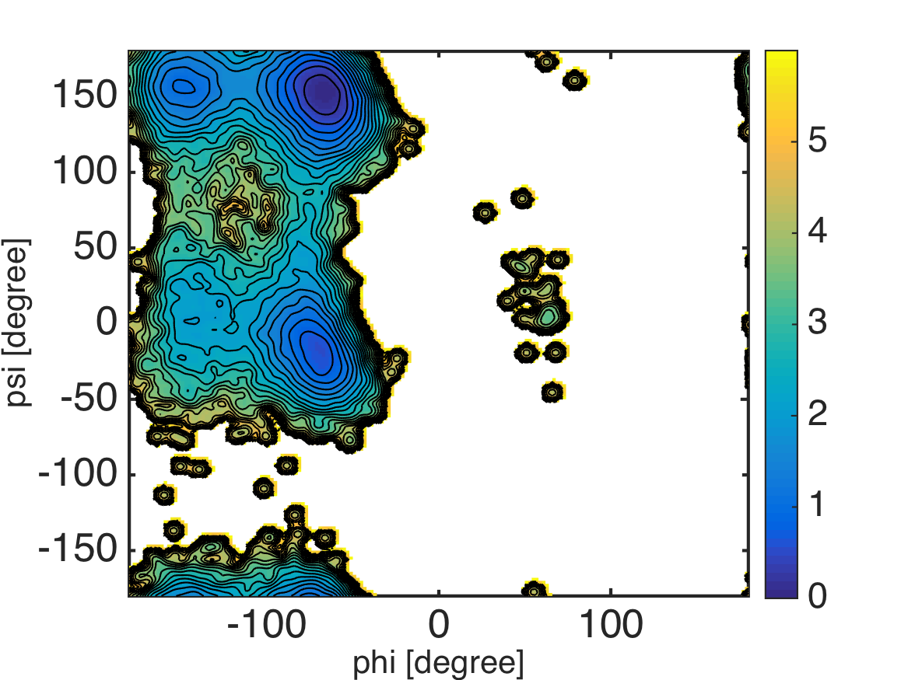

.. pmf
.. highlight:: matlab

==============================================================
Potential of mean force (PMF) from scattered data (``example/md_ala/pmf``)
==============================================================

Here, we calculate the surface of potential of mean force (PMF) in a 2-dimensional dihedral angle space. Molecular dynamics trajectory of alanine-dipeptide solvated in TIP3P waters is used for the demonstration. 

First, we extract the dihedral angles from the trajectory: 
::
  
  %% read data
  trj = readnetcdf('../3_prod/run.nc');
  
  %% define atom indices for dihedral angles
  index_phi = [5 7 9 15];
  index_psi = [7 9 15 17];
  
  %% calculate dihedral angles
  phi = calcdihedral(trj, index_phi);
  psi = calcdihedral(trj, index_psi);
  
  %% convert the unit from radian to dgree
  phi = phi.*180./pi;
  psi = psi.*180./pi;

Next, we estimate the probability density function (PDF)
in the 2-dimentional dihedral space from the scattered data (``phi`` and ``psi``).
This can be done by using the (bivariate) kernel density
estimation (``kde2d.m``), and the PMF is defined as minus log of the PDF: 
::

  %% scattered plot of the dihedral angles
  scatter(phi, psi, 5, 'filled');
  axis([-180 180 -180 180]); axis xy;
  formatplot2
  xlabel('phi [degree]', 'FontSize', 20, 'FontName', 'Helvetica');
  ylabel('psi [degree]', 'FontSize', 20, 'FontName', 'Helvetica');
  exportas('scatter');
  
  %% calculate PMF and visualize the surface
  [pmf, xi, yi] = calcpmf2d([phi psi], 500); % calcpmf2d() calls kde2d()
  s   = getconstants();  % get Boltzmann constant in kcal/mol/K
  T   = 300.0;           % set temperature
  pmf = s.KB*T*pmf;        % convert unit from KBT to kcal/mol
  
  level_max = 6.0;
  pmf2 = pmf;
  pmf2(pmf2 > level_max) = NaN;
  pcolor(xi, yi, pmf2);
  shading flat;
  colorbar;
  axis([-180 180 -180 180]); axis xy;
  formatplot2;
  
  hold on
  contour(xi, yi, pmf2, 0:0.25:level_max, 'linecolor', 'black');
  hold off
  
  xlabel('phi [degree]', 'FontSize', 20, 'FontName', 'Helvetica');
  ylabel('psi [degree]', 'FontSize', 20, 'FontName', 'Helvetica');
  exportas('pmf');

.. image:: ./images/scatter.png
   :width: 70 %
   :alt: scatter
   :align: center

Note that the kernel density estimator introduces some biases which
smooth out the 'true' PDF surface. So, we should be careful
especially when focusing on the barrier heights of PMF. 

